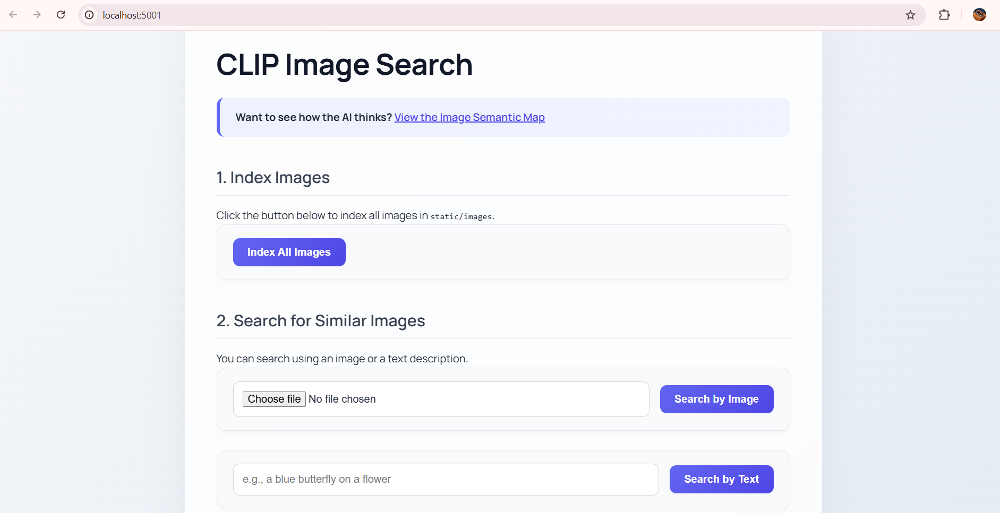
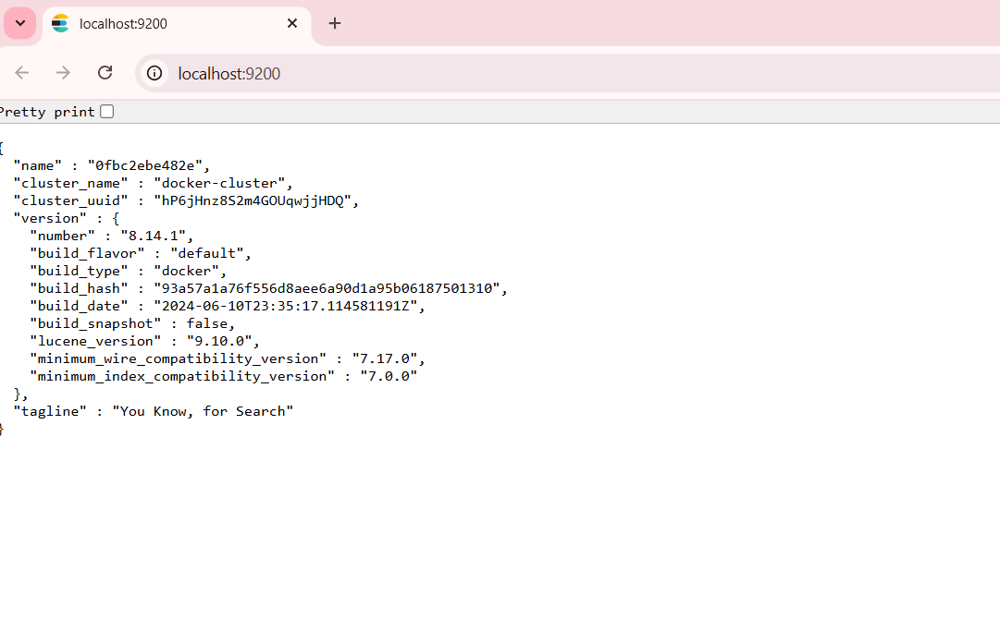
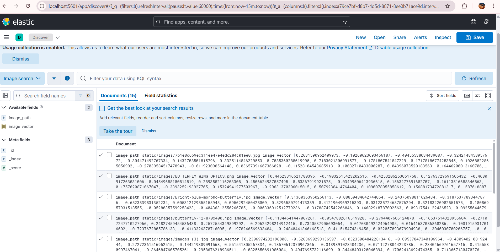
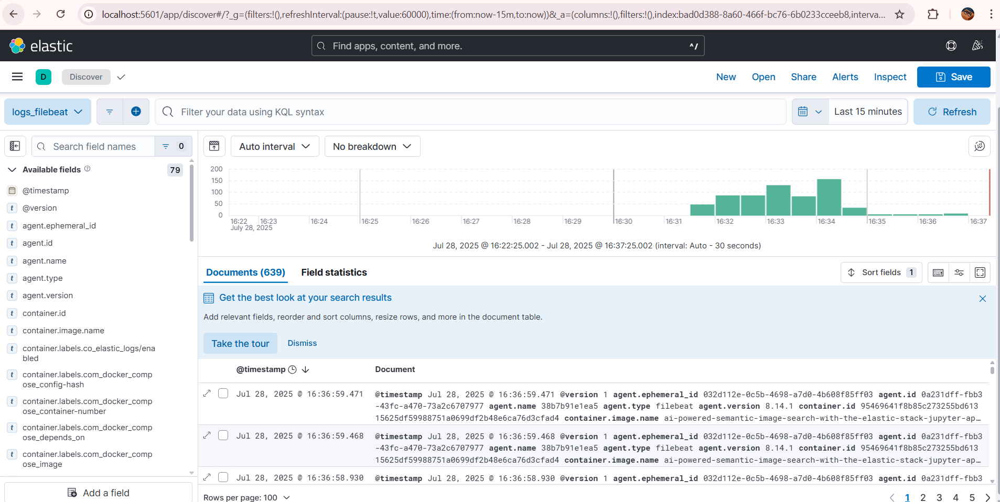

# ELK Stack for Image Similarity Search

This project is a full-stack web application that allows you to search for images based on their conceptual meaning, not just tags or filenames. You can search using either a text description (e.g., "a blue butterfly on a flower") or by uploading another image.

The entire application and its monitoring backend are fully containerized using Docker Compose, creating a complete, end-to-end, and reproducible MLOps environment.

<h3>Project Showcase</h3>
<p>A complete overview of the running system, from the front-end application to the Elastic Stack backend components.</p>

<table>
  <tr>
    <td align="center"><strong>1. Web Application UI</strong></td>
    <td align="center"><strong>2. Elasticsearch Database</strong></td>
  </tr>
  <tr>
    <td></td>
    <td></td>
  </tr>
  <tr>
    <td align="center"><strong>3. Kibana Dashboard</strong></td>
    <td align="center"><strong>4. Filebeat Logs in Kibana</strong></td>
  </tr>
  <tr>
    <td></td>
    <td></td>
  </tr>
</table>

---

## ✨ Features

- **Multi-Modal Semantic Search**: Search for images using either a text query or an image query.  
- **AI-Powered Embeddings**: Utilizes the pre-trained CLIP model (ViT-B-32) from `sentence-transformers` to generate 512-dimensional vector embeddings for both text and images.  
- **High-Speed Vector Search**: Uses Elasticsearch as a vector database to perform efficient k-Nearest Neighbor (k-NN) similarity searches.  
- **Interactive Visualization**: A 2D semantic map of all indexed images, created using UMAP for dimensionality reduction and Plotly for interactive plotting.  
- **Full Observability Stack**: The system is monitored by the Elastic Stack (Filebeat, Logstash, Elasticsearch, Kibana) for centralized logging and diagnostics.  
- **Containerized & Reproducible**: The entire 5-service stack is defined in a single `docker-compose.yml` file for easy, one-command deployment.  

---

## 🛠️ Tech Stack & Architecture

### **Core Application**
- **Backend**: Python 3.9, Flask  
- **AI Model**: `sentence-transformers` (CLIP)  
- **Image Processing**: Pillow  
- **Visualization**: UMAP, Plotly, NumPy  

### **Database & Search**
- **Vector Store**: Elasticsearch 8.14.1  

### **Observability Stack**
- **Log Collection**: Filebeat  
- **Log Processing & Enrichment**: Logstash  
- **Log Storage & Analysis**: Elasticsearch  
- **Visualization & Dashboards**: Kibana  

### **DevOps**
- **Containerization**: Docker & Docker Compose  

---

## 📂 Project Structure

```

image-search-app/
├── config/
│   ├── filebeat/
│   │   └── filebeat.yml          # Configures Filebeat to collect logs
│   └── logstash/
│       └── pipeline/
│           └── logstash.conf     # Configures the Logstash processing pipeline
├── static/
│   ├── images/                   # Your images go here
│   └── uploads/                  # Query images are temporarily stored here
├── templates/
│   ├── index.html                # Main search page
│   ├── style.html                # CSS style
│   └── visualize.html            # Visualization page
├── app.py                        # The main Flask application logic
├── docker-compose.yml            # Defines and orchestrates all 5 services
├── Dockerfile                    # Builds the Python/Flask application container
└── requirements.txt              # Python dependencies

````

---

## 🚀 Getting Started

### **Prerequisites**
- Git  
- Docker  
- Docker Desktop (or Docker installed on Linux)  
> **Important**: Ensure Docker Desktop has at least 6–8 GB of memory allocated (`Settings > Resources`).  

---

### **Installation & Setup**

**1️⃣ Clone the repository**
```bash
git clone <this repo>
cd image-search-app
````

**2️⃣ Create necessary directories**
Ensure the `config/` directories and `static/images` directory exist as shown above.

**3️⃣ Add your images**
Place searchable images inside:

```
static/images/
```

**4️⃣ Build and run the stack**

```bash
docker-compose up --build
```

The first run will download model weights and images, so it may take several minutes.

---

## 📌 How to Use

1. **Access the Image Search App**

   * [http://localhost:5001](http://localhost:5001)

2. **Index Your Images (CRITICAL FIRST STEP)**

   * Click the **"Index All Images"** button in the web app.
   * Watch logs to confirm indexing.

3. **Search**

   * Use the **text search box** or **upload an image** to find conceptually similar results.

4. **Explore the System**

   * **Kibana (Logging UI)**: [http://localhost:5601](http://localhost:5601)
   * **Elasticsearch (Database API)**: [http://localhost:9200](http://localhost:9200)
   * **Visualization Map**: [http://localhost:5001/visualize](http://localhost:5001/visualize)

---

## 🛣️ Future Enhancements (Roadmap)

* Fine-tune the CLIP model for domain-specific datasets.
* Implement hybrid search (vector + keyword).
* Build Kibana dashboards for Flask log metrics.
* Scale the system for larger datasets with multiple Elasticsearch nodes.

---

## 📄 License

This project is licensed under the **MIT License**. See the `LICENSE` file for details.
